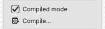
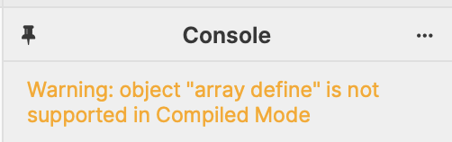
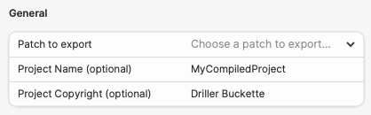
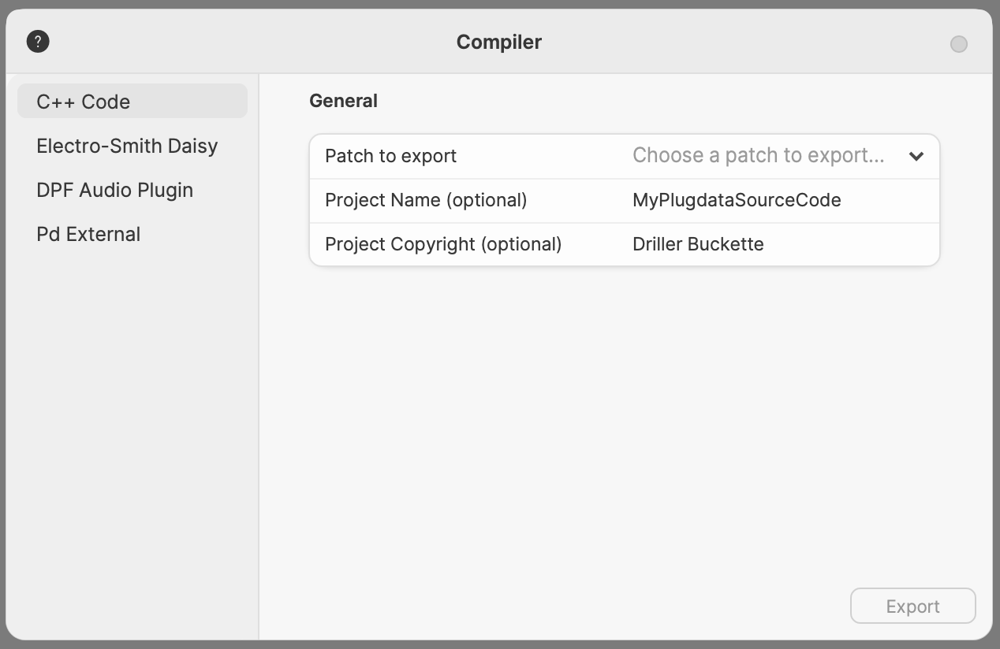
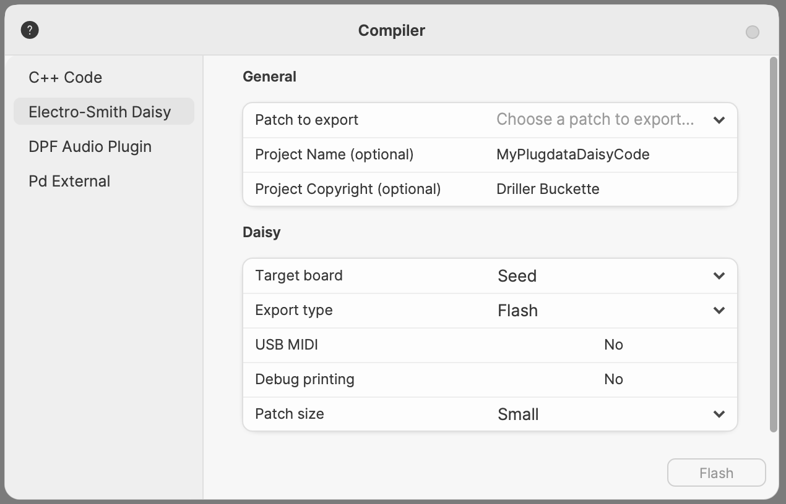
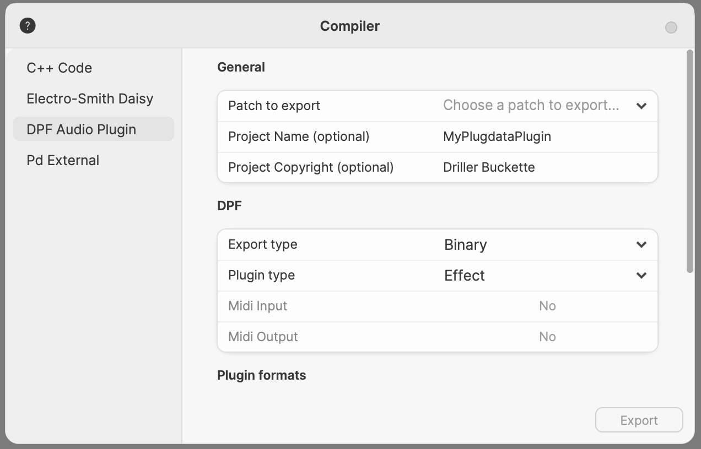
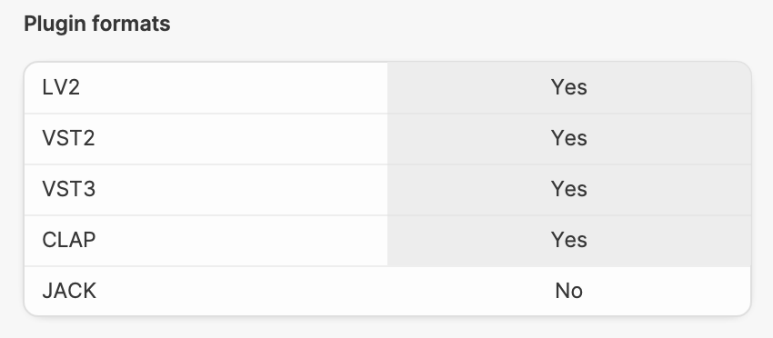
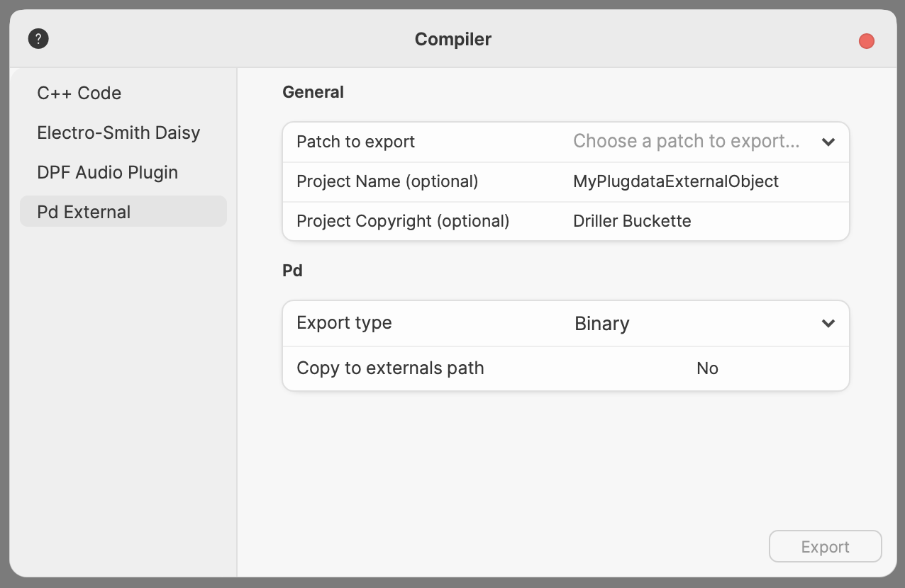

# Compiling and Compiled Mode

Not only can you run plugdata as an audio plugin inside your DAW, plugdata provides the ability to compile your plugdata code for multiple targets, including audio plugins. The currently supported targets are:

- C++ code
  - C/C++ source code for use in other DSP projects
- Electro-Smith Daisy
  - Compilation for and flashing of a Daisy microcontroller board.
- DPF Audio Plugin
  - An audio plugin that can be an audio effect, instrument, or custom MIDI plugin. To be used by itself in the majority of DAWs.
- Pd External
  - Compile your patch into a Pd external object that can be used in PureData or plugdata like a built-in object.

>[!WARNING]
>When exporting code or plugin binaries, as of writing, the destination path cannot contain *any* spaces.

## Compiled Mode

In the main plugdata menu, you will find a toggle box labelled ***Compiled Mode***.

Compiled mode checks your patch for compliance with the plugdata compilation tools.
Included with plugdata is the [Heavy hvcc compiler](https://wasted-audio.github.io/hvcc/docs/01.introduction.html#what-is-heavy) maintained by [Wasted Audio](https://wasted.audio/). hvcc can only compile plugins using a portion of the objects included with plugdata, which are a subset of the Pure Data Vanilla set of objects.

***Compiled Mode*** indicates if there are objects in your patch that cannot be used in a compiled patch by posting a message to the Console, and outlining the object in question. The auto-completion in plugdata will also only provide compatible objects when this mode is activated.

Object error indication when using an unsupported object in Compilation Mode

Console error warning when using an unsupported object in Compilation Mode

## Compiling in plugdata

When you select `Compile...` a window opens with several compilation options along the left.
Each option has a general section displaying the common options for all modes and then specific options for the mode you currently have selected.

### General

This section is found in every compilation mode, with the following fields:

- Patch to export
  - If a patch is currently open, it will read "Currently opened patch" otherwise it will read "Choose a patch to export...". Select the patch you wish to export here.
- Project Name (Optional)
  - The name of the project (potentially different than the patch name). This will autofill to your patch's name, or the last name you typed in this field.
  - Project Copyright (optional). If you want to share your code you can put it under one of the [common source licenses](https://spdx.org/licenses/) available.

## C++ Code

In the C++ Code mode, your plugdata patch isn't actually compiled, instead it is [transpiled/transcompiled](https://en.wikipedia.org/wiki/Source-to-source_compiler) from one coding language (Pd) to another (C/C++). The plugdata patch is transpiled to a generic C/C++ output and the raw code will need to be adapted for a specific application. Read more about the C/C++ API in the [official documentation](https://wasted-audio.github.io/hvcc/docs/05.c.html).

## Electro-Smith Daisy

Daisy is an embedded platform for music produced by [Electro-Smith](https://electro-smith.com). It features everything you need for creating high fidelity audio hardware devices. This option allows to run your patch on an embedded hardware device based on an STM32 microcontroller. Read more about the Daisy exporter in the [official documentation](https://wasted-audio.github.io/hvcc/docs/03.gen.daisy.html).

- Target board
  - Choose from a selection of predefined Daisy boards, or supply your own custom json file.
- Export type
  - **Source Code** exports the plugdata patch into C/C++ code that can be externally compiled for Daisy.
  - **Binary** produces a binary file that can be flashed onto a Daisy board manually.
  - **Flash** Compile and flash the program directly onto a connected Daisy board (this is the default).
- USB MIDI
  - This will enable MIDI i/o on the onboard microusb connection.
- Debug printing
  - This will make the `[print]` object output over serial. It wil automatically disable the `USB MIDI` option.
- Patch size
  - By default the Daisy is programmed on the internal Flash memory (small). It is also possible to flash a bootloader and then program to either `SRAM` (big) or `QSPI` (huge) memory regions. These are bigger than internal Flash, but are also potentially slower, which may impact performance. If the bootloader is not detected plugdata will try to first flash it to your Daisy board. Using the `Custom Linker` option you can provide your own advanced linker script for a custom memory layout.

## DPF Audio Plugin

While plugdata itself can run as a plugin, you can also export self contained versions of your patch in the VST2, VST3, LV2, CLAP, and JACK standalone formats. HVCC uses the [DISTRHO Plugin Framework](https://github.com/DISTRHO/DPF) to generate these plugins.

### DPF

- Export type
  - **Source code** exports the plugdata patch into C/C++ source code that can be externally compiled into an audio plugin
  - **Binary** produces an executable plugin that can be loaded into any plugin host.

- Plugin type. This automatically defines the MIDI input/output parameters, which is used by some hosts to categorize plugins and their functionality.
  - **Effect** is a plug in that accepts input audio, processes the audio, and outputs audio. It doesn't accept MIDI nor does it output MIDI.
  - **Instrument** is a plugin that accepts MIDI input to control the software instrument contained in the plugin, and outputs audio. Will not accept audio nor output MIDI.
  - **Custom** allows you to break with the effect or instrument conventions. This would be the type to choose if you wanted to create a plugin that modifies MIDI, for instance, as you can set the plugin to accept MIDI input but set it to also output MIDI data (also known as a MIDI effect). Not all hosts will allow such plugins.

The Heavy Compiler supports many more options for the DPF target, however these are not included in the plugdata export menu yet. You can read more about the DPF exporter in the [official documentation](https://wasted-audio.github.io/hvcc/docs/03.gen.dpf.html).
  
### Plugin formats

Here you select the formats you wish to output your patch as. You can select as many or as few formats as you like. JACK standalone is deselected by default, as many users do not have a JACK server available on their system.

## Pd External

plugdata allows you to write abstractions that look and operate like built in objects. Abstractions however can't run as efficiently as an object that is a compiled binary. By exporting your patch into a Pd external, which can be used in plugdata or regular Pd, you can optimize its performance and reuse it in your regular patches. Read more about the Pd External option in the [official documentation](https://wasted-audio.github.io/hvcc/docs/03.gen.pdext.html).

- **Export Type**
  - Export your compiled external as a Binary (an object ready to be used in Pd) or as source code for further modification and compilation.
  
- **Copy to externals path**
  - This will create a copy of the external object in the plugdata/Externals folder  
